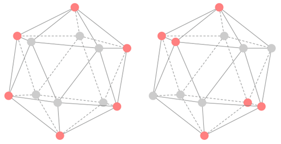

# 3-WL Counterexamples Searching

Search for counterexamples of 3-WL on Icosahedron and Dodecahedron

## Take *12_2.py* as an example:

### 1. Generate 3D graphs:

The program first selects **2** vertices in the dodecahedron, and then symmetrically obtains a 3D map of **4** vertices.

### 2. WL test:

Call the function in ***k_wl.py***, use 3-WL to test the isomorphism between pairs of 3D graphs.

### 3. Permutation test:

Call the function in ***true_yes.py*** to perform the isomorphism test between pairs of 3D graphs. This process performs isomorphism test based on permutation analysis, whose result must be correct.

### 4. Judge:

If the 3-WL test result is "isomorphic", but the permutation test result is "non-isomorphic", store this pair of 3D graphs as a counterexample.

(Similarly, ***20_3.py*** is used to find counterexamples of **6** vertices in the icosahedron, and so on.)

(For the convenience of display, ***output_12_5.txt*** shows the output of ***12_5.py***)

---

### The correctness of the program:

Since the following 2-WL counterexample exists in the icosahedron, change ***k_wl_test(A1, A2, 3)*** in line 126 of 20_3.py to ***k_wl_test(A1, A2, 2)***. Then run 20_3.py, and the program will output this counterexample, which means the program is correct.

(This image is from Li Z, Wang X, Huang Y, et al. Is Distance Matrix Enough for Geometric Deep Learning?[J]. arXiv preprint arXiv:2302.05743, 2023.)
